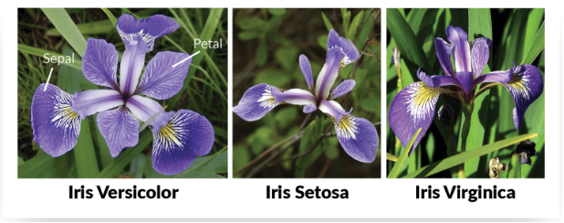
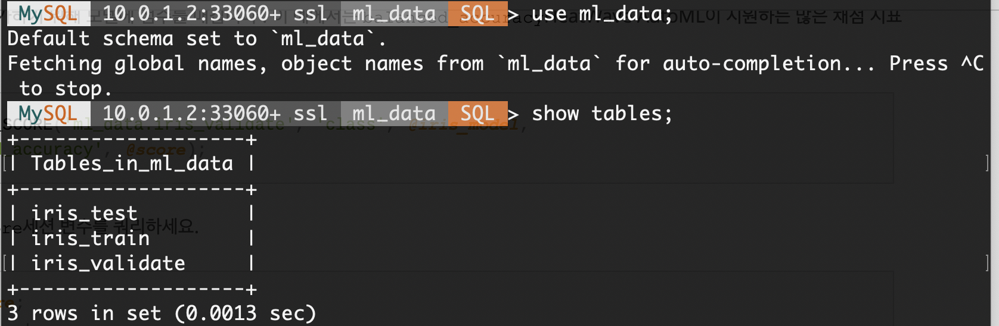
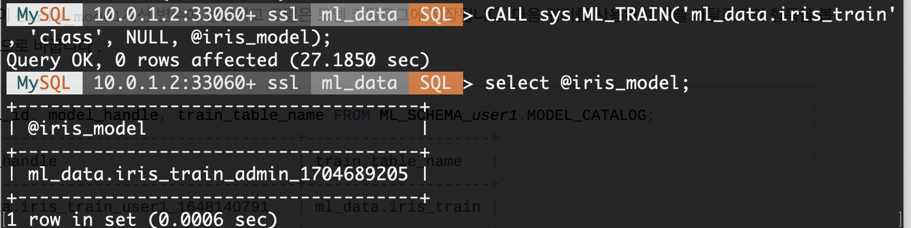
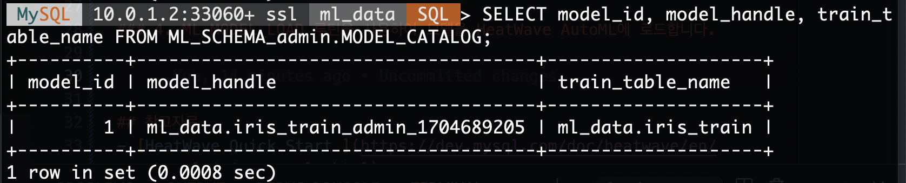
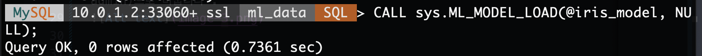
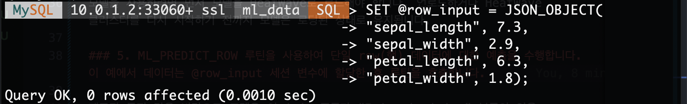
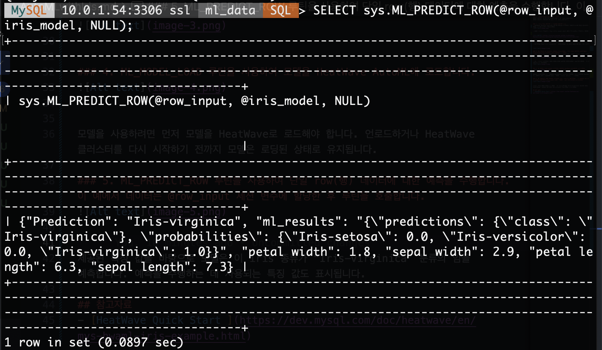
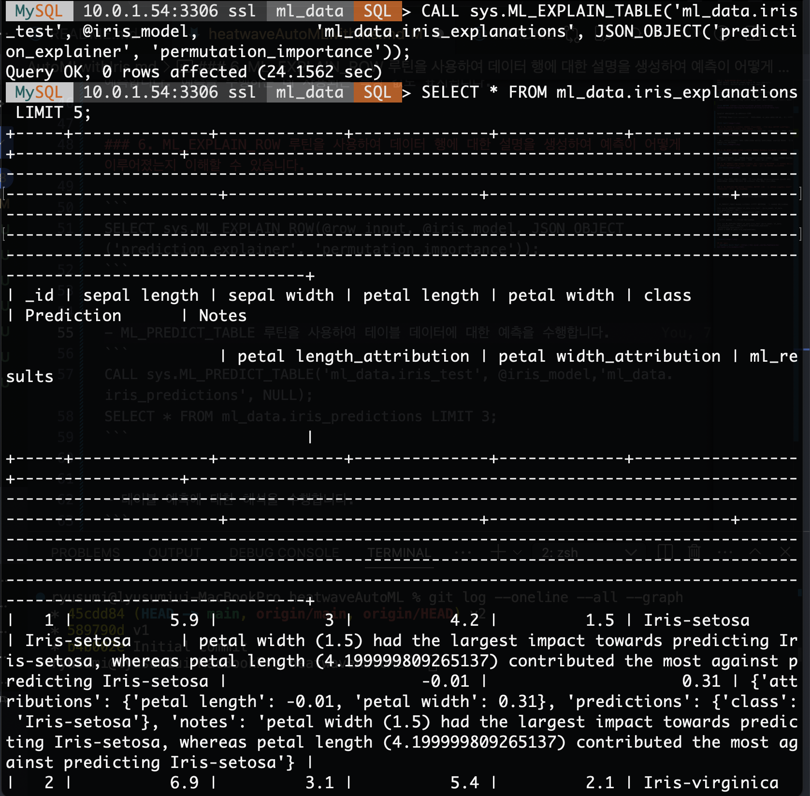
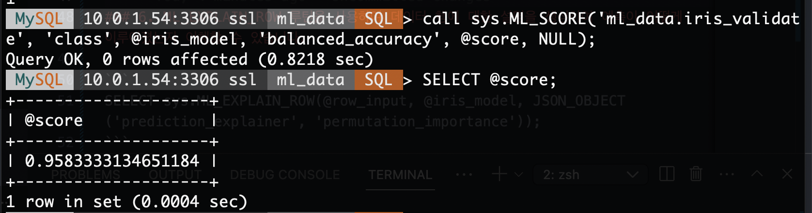

### 1.	MySQL계정에 필요한 권한 확인
GRANT SELECT, ALTER ON schema_name.* TO 'user_name'@'%';
GRANT SELECT, EXECUTE ON sys.* TO 'user_name'@'%';


### 2.	Iris 학습 데이터 및 테스트 데이터 로딩
- HeatWave Machine Learning (ML)의 기능을 사용하여 붓꽃(Iris)의 종을 분류하는 머신러닝 프로젝트를 실습합니다.


- 아래 링크를 클릭해서 해당 쿼리를 mysql shell 또는 클라언트를 이용해서 MDS에 적용


[Iris 데이터 ](https://oracle-livelabs.github.io/database/heatwave-machine-learning/do-heatwave-ml/files/iris-ml-data.txt) 

```
mysqlsh admin@<mds ip address>:3306
```
- 데이터가 정상적으로 로딩되었는지 확인합니다. ml_data 스키마에 다음 3개 테이블이 있습니다.




### 3. ML_TRAIN 을 사용하여 모델을 학습합니다 . 이는 분류 데이터 세트이므로 classification을 사용하여 분류 모델을 만듭니다.
- 학습 작업이 완료되면 모델 핸들이 @iris_model세션 변수에 할당되고 모델은 모델 카탈로그에 저장됩니다. 



- 다음 쿼리를 사용하여 모델 카탈로그의 항목을 확인합니다. user1을 MDS의 관리 계정(ex. admin)으로 바꿉니다 .



### 4. ML_MODEL_LOAD 루틴을 사용하여 모델을 HeatWave AutoML에 로드합니다.



모델을 사용하려면 먼저 모델을 HeatWave로 로드해야 합니다. 언로드하거나 HeatWave 클러스터를 다시 시작하기 전까지 모델은 로딩된 상태로 유지됩니다.

### 5. ML_PREDICT_ROW 루틴을 사용하여 단일 row(행) 데이터에 대한 예측을 수행합니다. 이 예에서 데이터는 @row_input 세션 변수에 할당한 후 루틴을 호출합니다. 






제공된 특징 값을 바탕으로 모델은 이 iris 종류가 “Iris-virginica” 분류의 임을 예측합니다. 예측을 수행하는 데 사용되는 특징 값도 표시됩니다.


### 6. ML_EXPLAIN_ROW 루틴을 사용하여 데이터 행에 대한 설명을 생성하여 예측이 어떻게 이루어졌는지 이해할 수 있습니다.

```
SELECT sys.ML_EXPLAIN_ROW(@row_input, @iris_model, JSON_OBJECT('prediction_explainer', 'permutation_importance'));
```


- ML_PREDICT_TABLE 루틴을 사용하여 테이블 데이터에 대한 예측을 수행합니다.
```
CALL sys.ML_PREDICT_TABLE('ml_data.iris_test', @iris_model,'ml_data.iris_predictions', NULL);
SELECT * FROM ml_data.iris_predictions LIMIT 3;
```


- 테이블 예측에 대한 해석을 수행합니다.
```
CALL sys.ML_EXPLAIN_TABLE('ml_data.iris_test',@iris_model,'ml_data.iris_explanations', JSON_OBJECT('prediction_explainer', 'permutation_importance'));
SELECT * FROM ml_data.iris_explanations;
```







## 참고자료
- [HeatWave Quick Start ](https://dev.mysql.com/doc/heatwave/en/mys-hwaml-iris-example.html)